# Análisis de Visualizaciones - Top 100 Aeropuertos 
Este documento presenta las visualizaciones generadas a partir del análisis de los 100 aeropuertos más transitados del mundo. Cada visualización proporciona una perspectiva diferente sobre los datos, ayudando a comprender mejor el tráfico aéreo global. 

## 1. Top 10 Aeropuertos Más Transitados
Muestra los 10 aeropuertos con mayor número de pasajeros en el mundo. 
 
**Descripción:**  
Se observa una clara concentración del tráfico en unos pocos aeropuertos clave, destacándose aquellos ubicados en regiones económicas y turísticas importantes. La diferencia en el volumen de pasajeros entre los primeros y los últimos del ranking es notable.

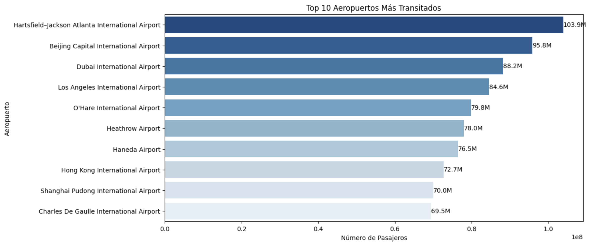

## 2. Distribución de Pasajeros en los Aeropuertos
Histograma que muestra la distribución de pasajeros en los distintos aeropuertos. 
 
**Descripción:**  
La mayoría de los aeropuertos manejan volúmenes moderados de pasajeros, con pocos alcanzando cifras extremadamente altas. Esto sugiere una distribución desigual del tráfico aéreo global.

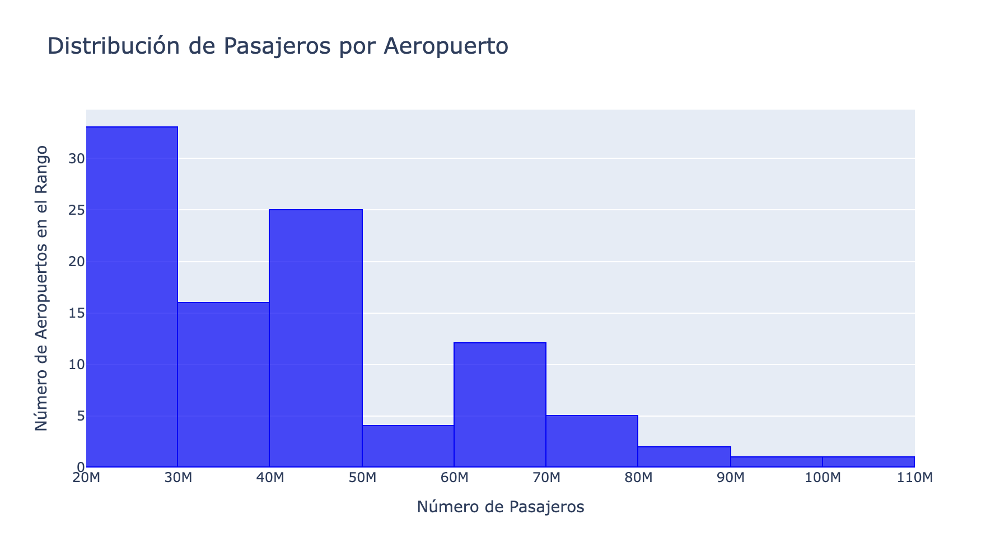

## 3. Distribución del Tráfico por País en los 10 Principales Países
Gráfico de barras apiladas que representa la distribución de tráfico aéreo en los principales países. 
 
**Descripción:**  
Se observa cómo algunos países dominan el tráfico aéreo mundial, con Estados Unidos y China liderando significativamente. Además, se nota una mayor concentración en aeropuertos específicos dentro de cada país.

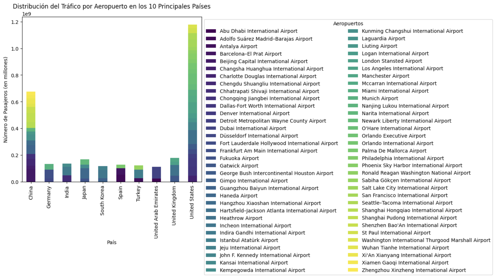

## 4. Tráfico Aéreo por País
Gráfico de líneas que muestra el tráfico aéreo total por país. 
 
**Descripción:**
Se identifican tendencias de crecimiento y decrecimiento en el tiempo, destacando períodos de auge económico o crisis que afectan directamente el tráfico aéreo.

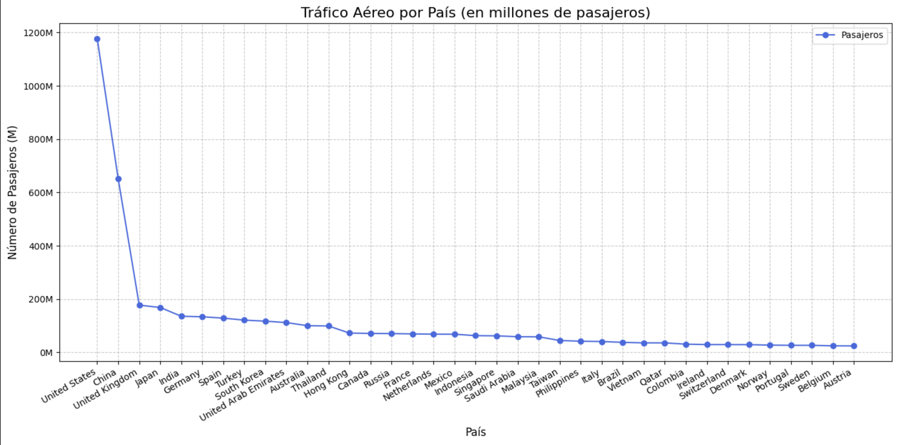

## 5. Top 10 Países con Mayor Tráfico Aéreo
Gráfico de barras horizontal mostrando los 10 países con mayor tráfico aéreo. 
 
**Descripción:**  
La gráfica evidencia cómo el tráfico aéreo se concentra en economías desarrolladas y potencias turísticas, con una notable diferencia entre el primer y el último país del top 10.

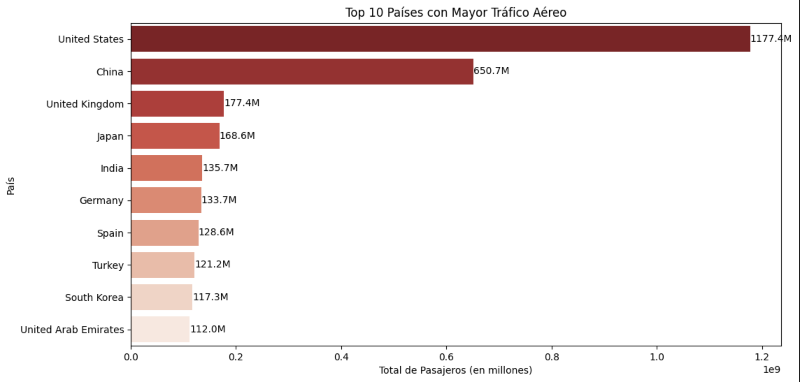

## 6. Análisis de Correlación
Mapa de calor de la matriz de correlación de las variables del dataset. 
 
**Descripción:**  
Se destacan relaciones significativas entre ciertas variables, como la correlación entre el volumen de pasajeros y la capacidad del aeropuerto, lo cual puede indicar oportunidades de optimización de infraestructura.

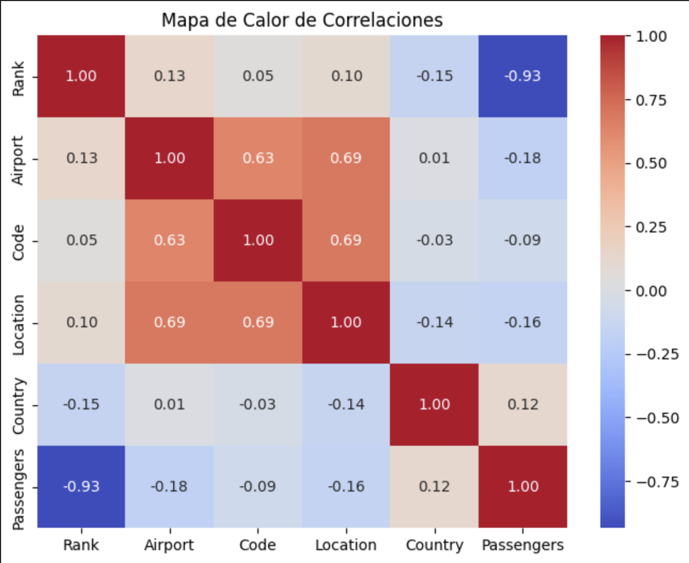

## 7. Clustering de Aeropuertos
Agrupación de aeropuertos basada en el tráfico de pasajeros. 
 
**Descripción:**  
Se identifican clusters que agrupan aeropuertos con patrones de tráfico similares, ayudando a segmentar estrategias operativas y comerciales.

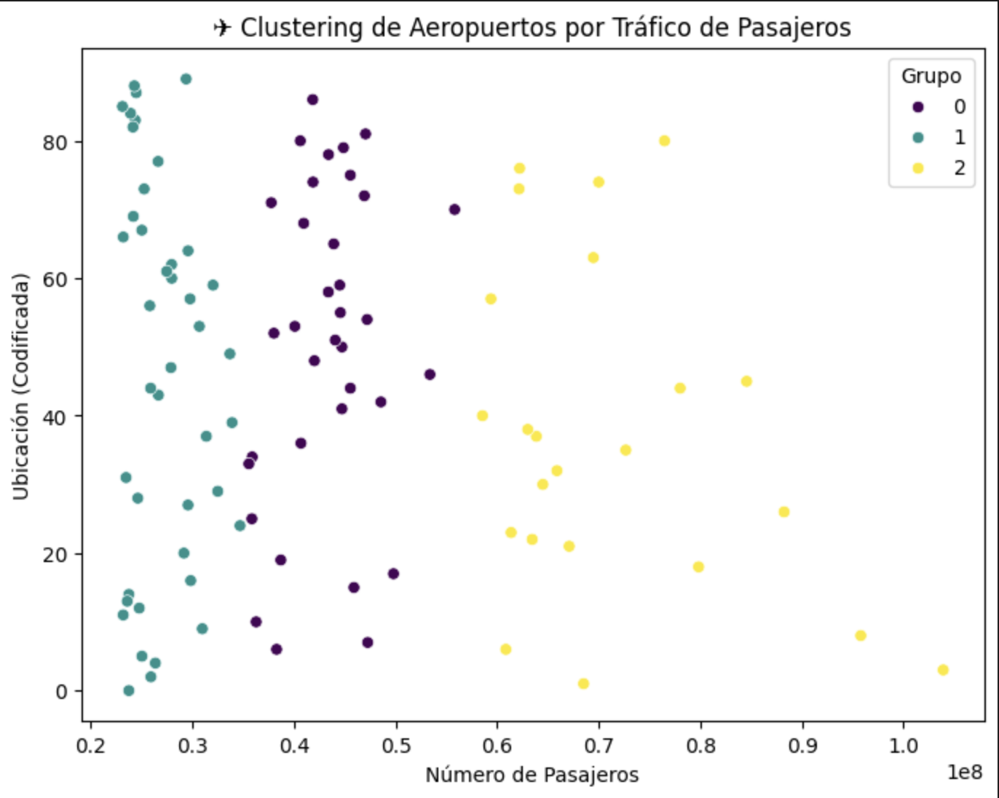
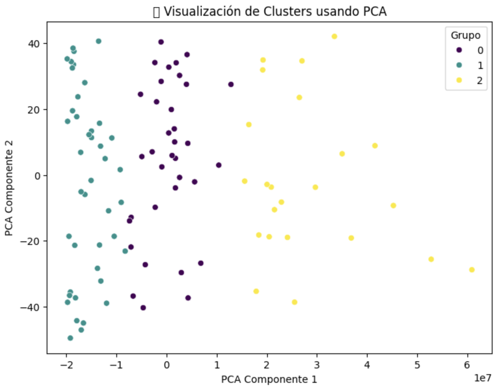

## 8. Mapa de Calor de Aeropuertos
Visualización geográfica del tráfico aéreo a través de un mapa de calor. 
 
**Descripción:**  
Se observa una alta concentración de tráfico en América del Norte, Europa y Asia, destacando hubs internacionales clave en el comercio global.

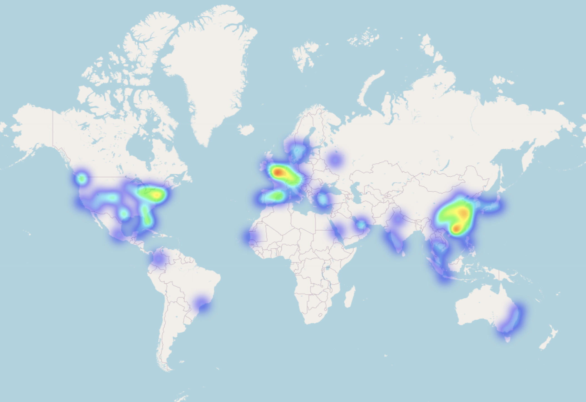

## 9. Distribución de Pasajeros por Aeropuerto
Histograma interactivo mostrando la distribución de pasajeros. 
 
**Descripción:**  
a distribución revela que pocos aeropuertos concentran la mayor parte del tráfico, sugiriendo una alta centralización en hubs específicos.

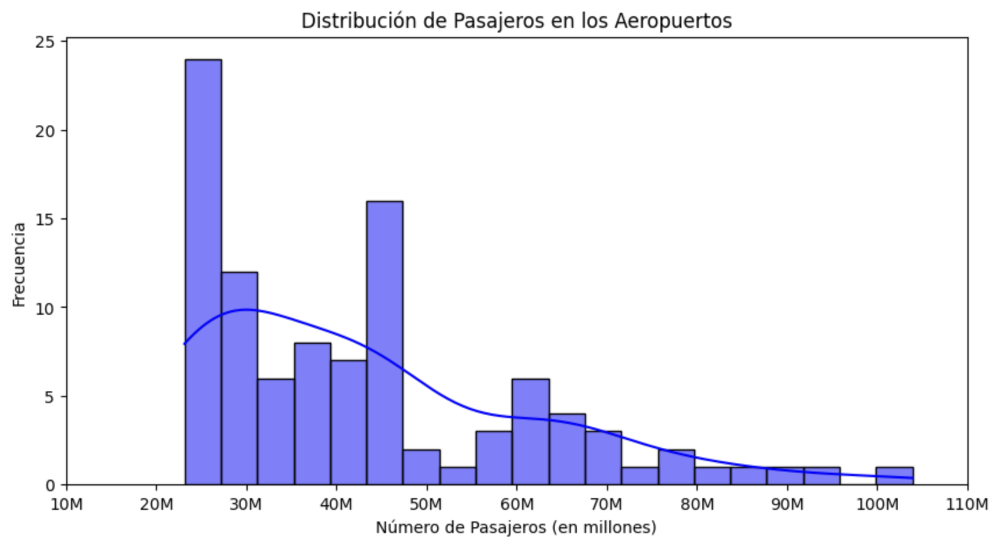

## 10. Tráfico de Países con Burbujas
Gráfico de burbujas que representa el tráfico aéreo por país. 
 
**Descripción:**  
La visualización permite comparar el tráfico total y la cantidad de aeropuertos por país, destacando el dominio de Estados Unidos y China en ambos aspectos.

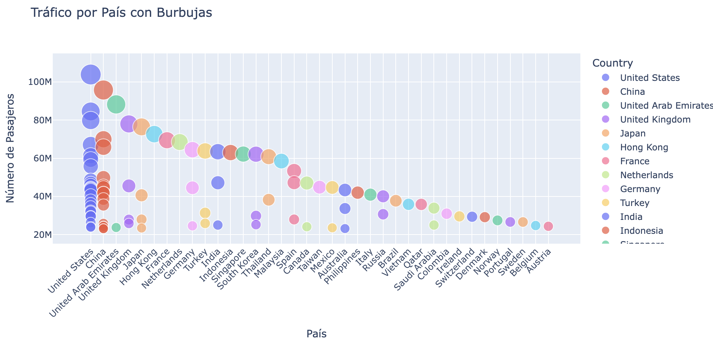
